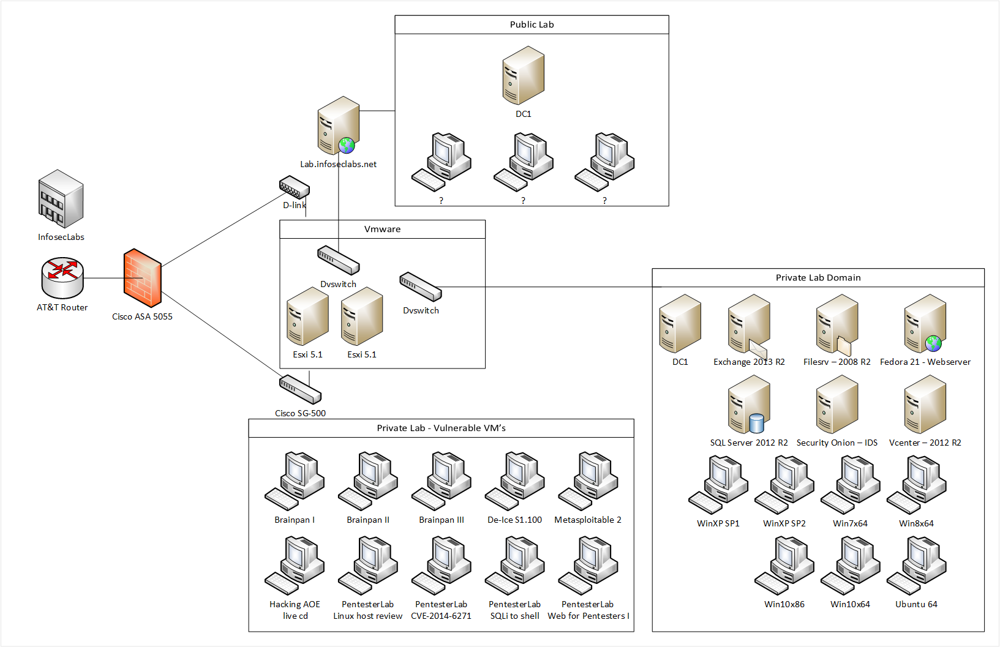

# InfosecLabs
A penetration testing lab designed and built for the purpose of teaching, researching, and testing offensive &amp; defensive security techniques

### How does this work?
Our public lab is meant to teach penetration testing through a full scale hands on penetration testing challenge
Our private lab is reserved for private research and teaching locally
If you would like to build your own lab and have questions you can  join us on irc(See IRC channel section)

### How do I connect to the public lab?
Please join us on irc for connection details

### IRC channel:
Anyone that has questions about building a lab is welcome to join us on Freenode in the channel #infoseclabs. We also have public facing labs that you can get details about by joining us on irc. The public lab is used to teach penetration testing through hands on challenges.

### Twitter:
If you have any questions about the lab please tweet to [@infoseclabs](https://twitter.com/Infoseclabs) or just tweet with #infoseclabs and one of the lab admins will respond

Network Diagram:

### Lab features:
* Windows domain/services
* Exchange 2013(fully functional)
* Windows Server 2012 R2 Domain controller
* Windows IIS
* Windows 2008 R2 File Server
* Windows Sharepoint Foundation 2013
* Windows 10
* Windows 8.1
* Windows 7
* Windows Vista
* Windows XP
* Varying Internet Explorer versions
* Red Hat Linux
* Web Servers(Linux)
* OpenVAS
* DMZ
* Kali Linux
* Security Onion(IDS)
* Metasploitable 2
* Owasp Mutillidae
* Hacking The Art of Exploitation live cd
* Pentesterlab – Web for Pentesters I
* Pentesterlab – Web for Pentestters II
* Pentesterlab – From SQL injection to Shell
* Pentesterlab – Shellshock CVE 2014-6271
* Brainpan I, II, III
* Custom vulnerable virtual machines

### Lab Admins:
* [TheHonz](https://twitter.com/IamtheHonz)
* [Sneakerhax](https://twitter.com/sneakerhax)
